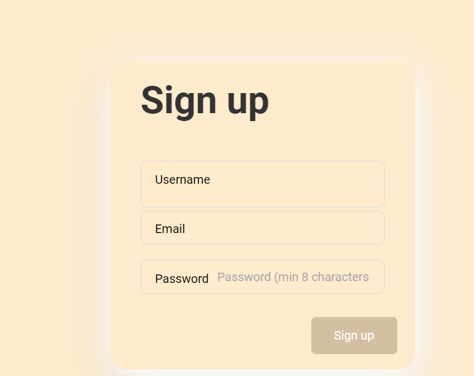
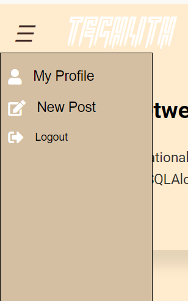
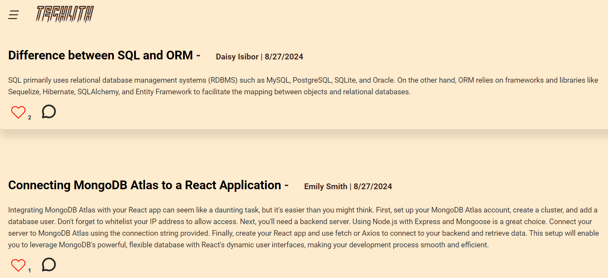
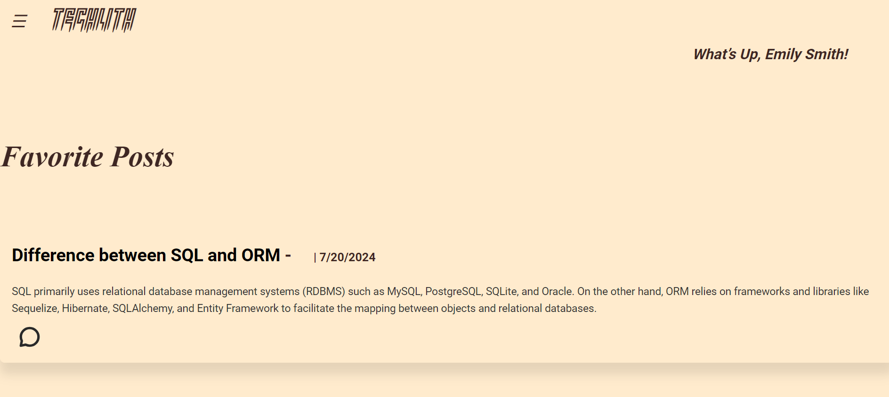
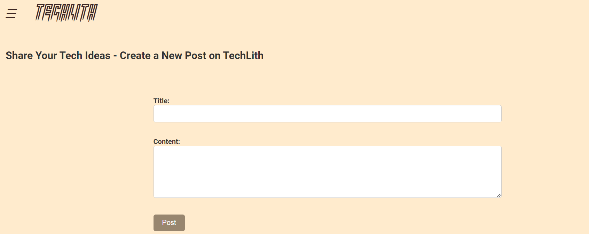
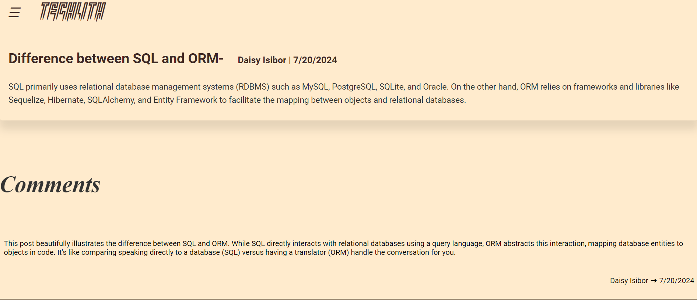
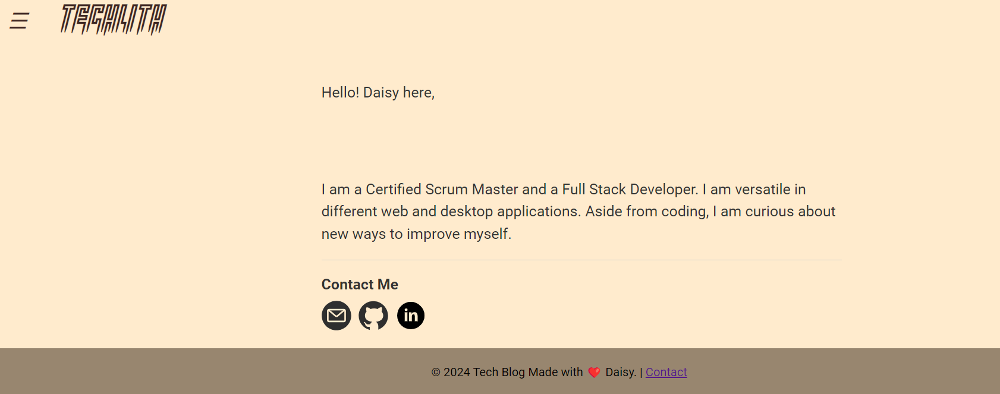

# TechLITH

## Deployed site : https://techlith-4cd8f6ed0198.herokuapp.com/

## Table of Contents
- [Description](#description)
- [Installation](#Installation)
  [User Story](#user-story)
  [Acceptance Criteria](#acceptance-criteria)
- [Usage](#Usage)
- [Tests](#Tests)
  [Questions](#questions)
- [License](#license)

## Description

TechLith is a dynamic online platform crafted specifically for tech enthusiasts and developers to connect, share, and innovate. As a cutting-edge CMS, TechLith empowers users to effortlessly publish and explore insightful articles, in-depth blog posts, and thought-provoking opinions across a wide range of technology topics. With its sleek, intuitive design and robust features, TechLith not only provides a seamless publishing experience but also ensures secure interactions through advanced bcrypt encryption for password protection. Engage with a vibrant peers, contribute to lively discussions, and stay at the forefront of tech trends with peers on TechLith’s powerful and user-friendly ecosystem.

## Installation

To install and run the Tech-Blog application, follow these steps:

Clone the repository from GitHub: git clone https://github.com/your-repo.git

Navigate into the project directory: cd tech-blog

Install dependencies: npm install

Set up your database by running the SQL schema file provided.

Create a .env file based on the .env.example and provide your environment variables.

Start the application: npm start

## User Story

AS A developer who writes about tech
I WANT a CMS-style blog site
SO THAT I can publish articles, blog posts, and my thoughts and opinions

## Acceptance Criteria

GIVEN a CMS-style blog site

WHEN I visit the site for the first time
THEN I see the homepage, which includes existing blog posts and navigation options.

WHEN I click any option on the page without being logged in
THEN I am prompted to log in or sign up if I do not have an account.

WHEN I choose to sign up and enter my details
THEN my information is saved in the database with the password encrypted.

WHEN I log in or sign up successfully
THEN I am automatically redirected to my profile page, where I am acknowledged as the user and can see my favorite posts.

WHEN I view the profile page
THEN I see a toggle menu bar with options to view my profile, create a new post, and log out.

WHEN I click on the "Create a New Post" option
THEN I am presented with a form to create a new post.

WHEN I submit the form to create a post
THEN I am redirected to the single post page where I can see the post and any associated comments and have the option to add a comment.

WHEN I click on the site name "techLith"
THEN I am redirected to the homepage where all user posts are displayed.

WHEN I view posts on the homepage
THEN I can click on each post to view its details, like a post, and see the comment icon to view or leave comments.

WHEN I like a post
THEN the post is automatically added to my favorites, which are displayed on my profile page.

WHEN I click on my created post
THEN I have options to edit, update, or delete the post.

WHEN I comment on a post
THEN as the commenter, I have the option to delete my comment.

WHEN I click the link to any post on the homepage
THEN I am directed to the single post page where I can view all comments and leave a comment.

WHEN I scroll to the footer and click on the "Contact" link
THEN I am navigated to a contact page to reach out to the owner of the site.

WHEN I click the "Logout" option from the menu bar
THEN I am logged out of the site but remain on the homepage until I choose to log in again.

## resources 
 links used for my tech blog 

 chatgpt

https://www.freecodecamp.org/news/how-to-build-sign-up-form-with-html-and-css/
https://github.com/fuuko08/MVC-Tech-Blog

## Usage
Once the application is installed and running, you can access it through your web browser. Users can:

View blog posts on the homepage.

Sign up for an account or log in with existing credentials.

Create new blog posts, edit, like a post or delete their existing posts from the dashboard.

Comment on posts to engage with other users.

http://localhost:3001/api/comments/7 
http://localhost:3001/api/comments
http://localhost:3001/api/comments/1
http://localhost:3001/api/comments

## Tests
To run tests for the Tech-Blog application, execute the following command:
npm start

To make sure heroku has all seeded information, execute the below command
heroku run npm run seed

## Questions

- **GitHub**: [daisy isibor](https://github.com/daisy isibor)
- **Email**: daisyisibor9@gmail.com
- **LinkedIn**: [daisy isibor] https://www.linkedin.com/in/daisy-isibor-fsd

## License
This project is licensed under the 

